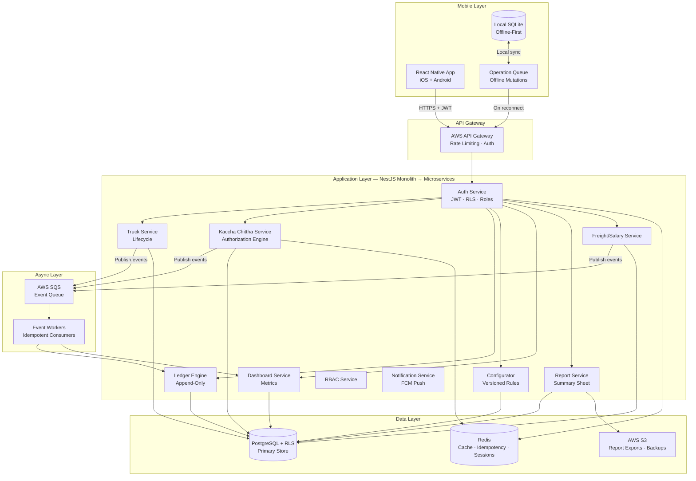
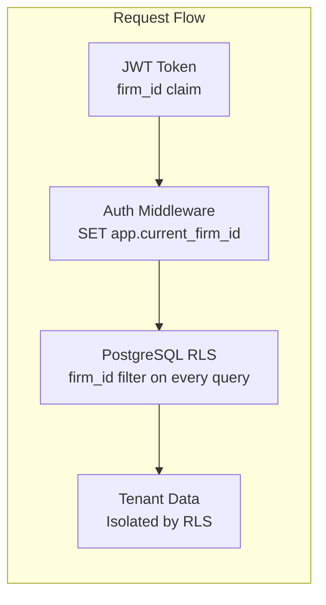
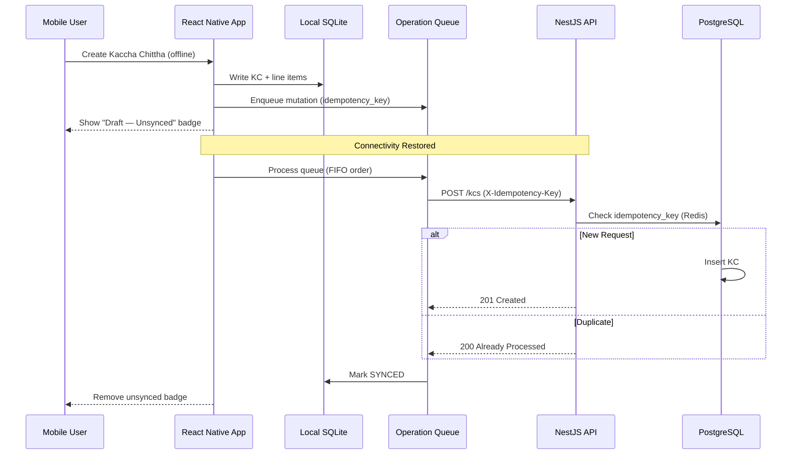
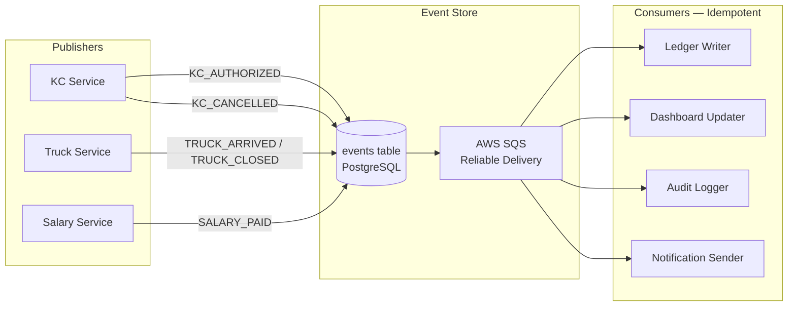
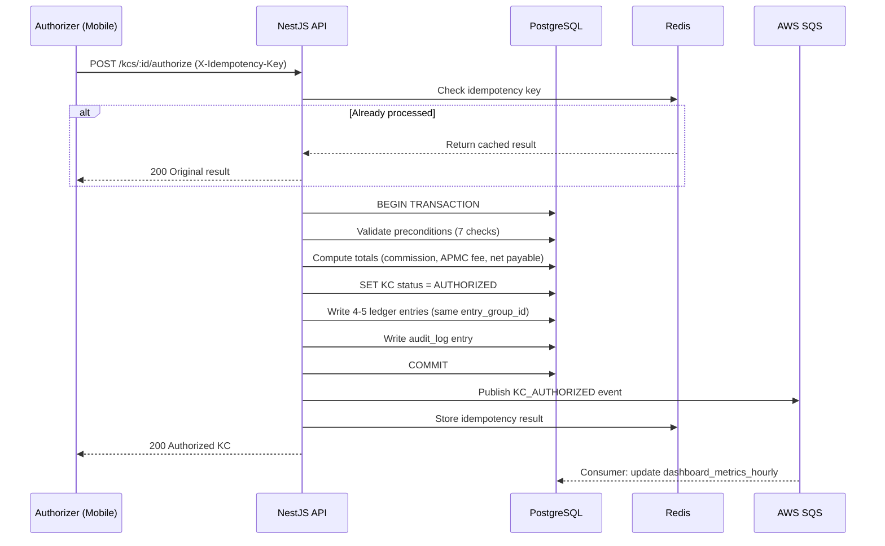
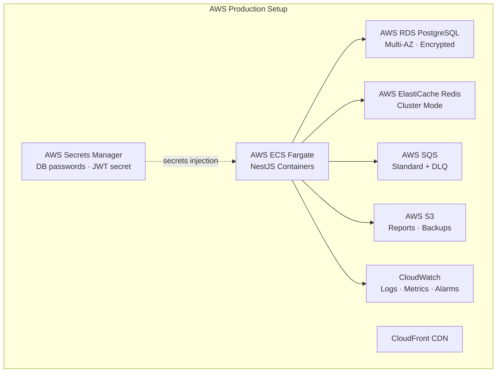
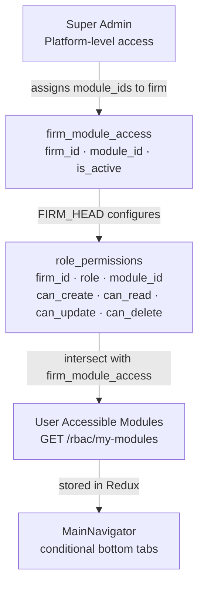
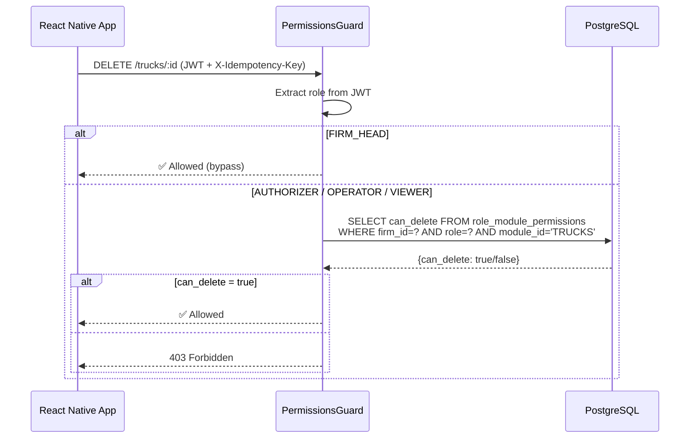

# Smart Mandi — High-Level Design (HLD)
## Version 2.0 · Phase 11 PDF Generation & SA Config Expansion (All Phases Complete)

---

## 1. System Overview

**Smart Mandi** is a multi-tenant SaaS mobile application that digitizes and automates the end-to-end workflow of agricultural produce trading firms (tenants) operating in Indian APMC mandis.

**Scale target:** 500 firms · 100,000 transactions/day · Financial auditability

**Current phase:** Phase 11 — PDF Generation, SA Config Expansion (all phases complete)

---

## 2. Architecture Overview



---

## 3. Multi-Tenancy Architecture



- Every table has `firm_id UUID NOT NULL`
- PostgreSQL Row-Level Security enforces isolation at DB level
- `firm_id` is extracted from verified JWT — never from user input

---

## 4. Offline-First Architecture



---

## 5. Event-Driven Architecture



---

## 6. Data Flow — KC Authorization (Critical Path)



---

## 7. Services & Modules Map

| Module | Responsibility | Phase |
|---|---|---|
| Auth | JWT, firm isolation, RBAC | 1 |
| Ledger Engine | Append-only ledger, group integrity | 1 |
| Event Store | Publish/consume events, retry, dead-letter | 1 |
| Audit Log | Immutable change history | 1 |
| Configurator | Versioned business rules | 2 |
| Customers | Customer CRUD + ledger view + history API | 2 |
| Kaccha Chittha | KC lifecycle + authorization engine + PDF download | 2/11 |
| Trucks | Truck lifecycle + purchase entries + delete guard | 3 |
| Dashboard | Precomputed metrics, alerts, date filters | 4 |
| Reports | Summary sheet, CSV export, cash flow, buyer summary PDF, daybook PDF | 4/11 |
| Salary | Salary entries + ledger + reversal-on-delete | 5 |
| Users | User CRUD + soft-delete (active filter) | 5 |
| Custom Fields | Dynamic entity extension (field defs + values) | 6 |
| RBAC | Module access control, dynamic role permissions | 7 |
| Super Admin | Cross-firm management, module + permission + full config assignment | 7/11 |
| Notifications | FCM push on KC authorization | 10 |
| PDF Config | SA-gated firm PDF settings (KC, buyer summary, daybook) | 11 |

---

## 8. Infrastructure Architecture



---

## 9. Security Architecture

| Layer | Control |
|---|---|
| Transport | HTTPS/TLS 1.3 everywhere |
| Authentication | JWT (RS256 prod / HS256 dev), 1h access token, 7d refresh token |
| Super Admin Auth | Separate SA JWT (HS256), validated via `?admin_token` query param |
| Authorization | Row-Level Security (PostgreSQL) — `current_setting('app.current_firm_id')` |
| RBAC | SUPER_ADMIN > FIRM_HEAD > AUTHORIZER > OPERATOR > VIEWER |
| Module Access | SA assigns modules to firms; FIRM_HEAD assigns CRUD per role per module |
| Idempotency | Redis-backed dedup on all mutations (24h TTL) |
| Audit | Append-only audit_log on every mutation |
| Secrets | AWS Secrets Manager injection |
| Input Validation | class-validator on all DTOs |

---

## 10. Super Admin Architecture

```mermaid
graph TB
    subgraph "Super Admin Panel (Mobile — Dark Theme)"
        SALogin[SA Login Screen<br/>phone + any OTP dev]
        SADash[SADashboardScreen<br/>Firm list + action tiles]
        SALogin --> SADash
    end

    subgraph "SA API Layer"
        SACtrl[SuperAdminController<br/>@Public() + verifySAToken()]
        SAFirms[GET/POST/PUT/DELETE<br/>/super-admin/firms]
        SAModules[GET/PUT<br/>/super-admin/firms/:id/modules]
        SAPerms[GET/PUT<br/>/super-admin/firms/:id/role-permissions/:role]
        SACtrl --> SAFirms
        SACtrl --> SAModules
        SACtrl --> SAPerms
    end

    subgraph "Firm User Panel (Main App)"
        Login[LoginScreen]
        Main[MainNavigator<br/>tabs from accessibleModuleIds]
        RolePerms[RolePermissionsScreen<br/>CRUD toggles per role per module]
        Login --> Main
        Main --> RolePerms
    end

    subgraph "RBAC API Layer"
        RbacCtrl[RbacController<br/>JWT-authenticated]
        MyMods[GET /rbac/my-modules]
        MyPerms[GET /rbac/my-permissions]
        FirmMods[GET /rbac/firm-modules]
        Perms[GET/PUT /rbac/permissions/:role]
        RbacCtrl --> MyMods & MyPerms & FirmMods & Perms
    end

    SADash -->|admin_token| SACtrl
    Main -->|JWT| RbacCtrl
```

---

## 11. Module Access Control Hierarchy



**Flow:**
1. SA creates firm → auto-grants all 11 modules
2. SA can restrict modules: PUT /super-admin/firms/:id/modules with subset of module_ids
3. **SA can configure role permissions**: PUT /super-admin/firms/:id/role-permissions/:role `{permissions: [{module_id, can_create, can_read, can_update, can_delete}]}`
4. FIRM_HEAD assigns CRUD permissions per role per module: PUT /rbac/permissions/:role
5. After login, mobile fetches GET /rbac/my-modules → stores `accessibleModuleIds` in Redux
6. MainNavigator renders only the tabs whose module keys are in `accessibleModuleIds`
7. Each screen calls `usePermissions(module)` → UI buttons (Add/Edit/Delete) conditionally rendered

---

## 12. Dynamic RBAC Flow



---

*Last updated: Phase 11 — PDF Generation, SA Config Expansion (all phases complete)*
