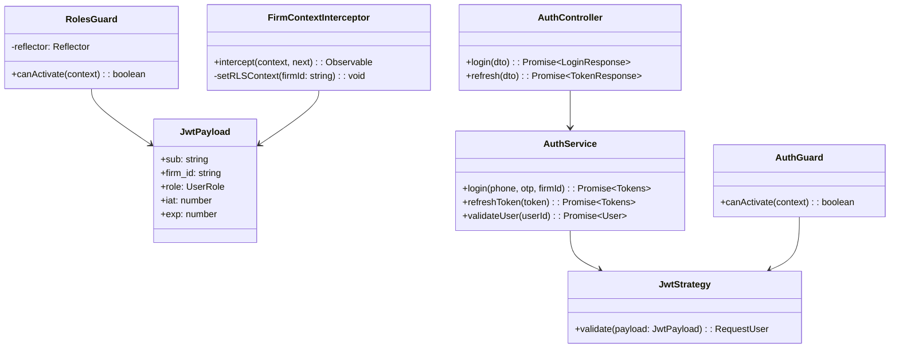
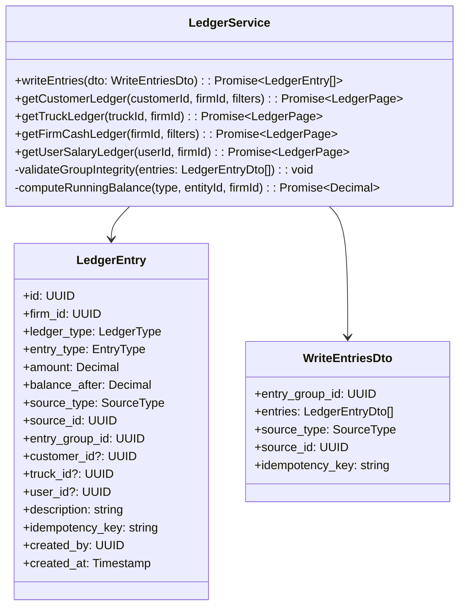
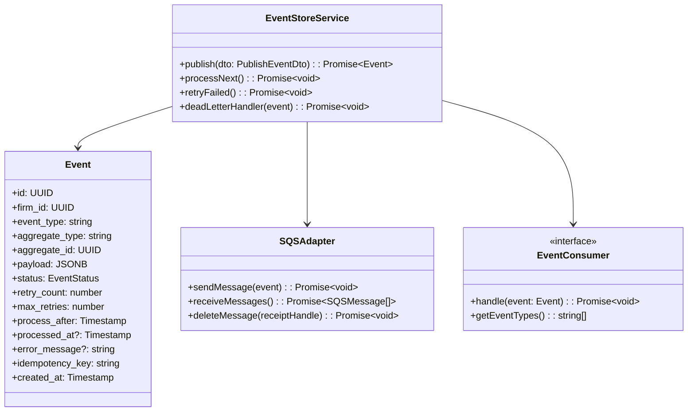
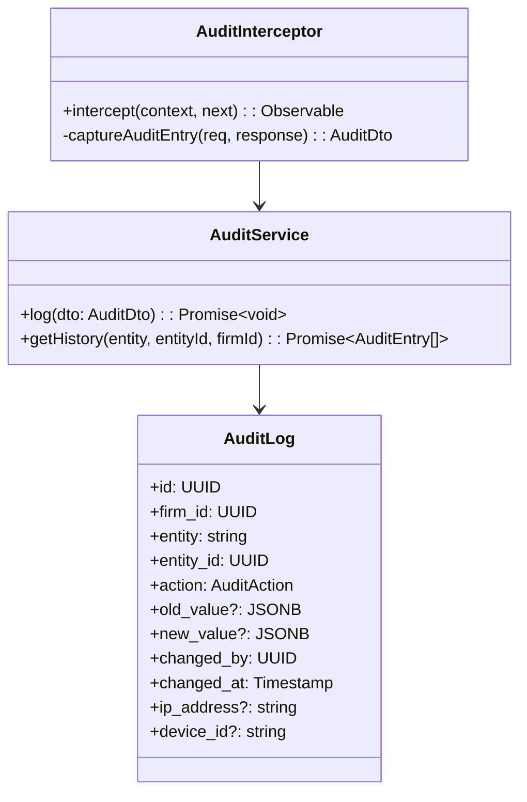
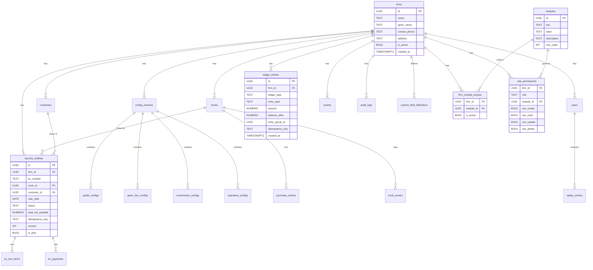
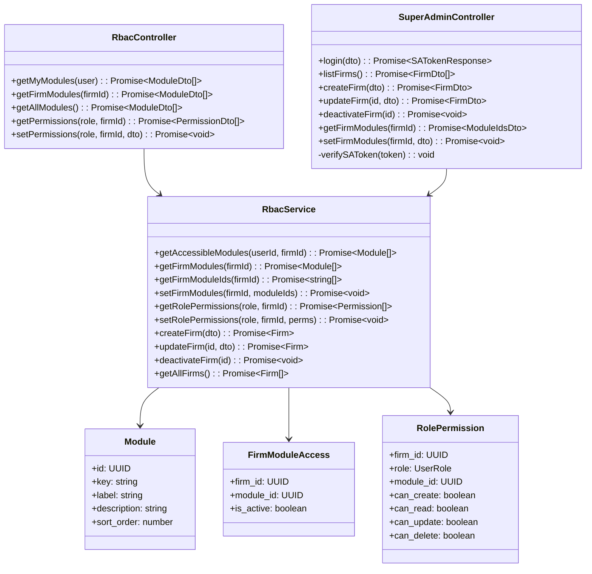
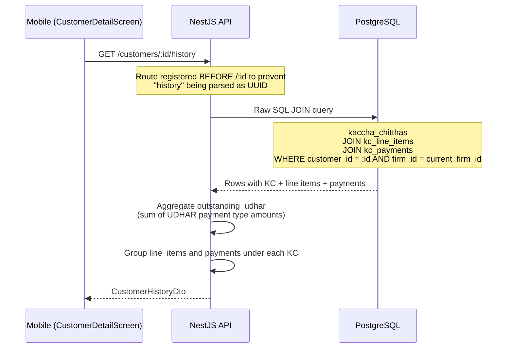
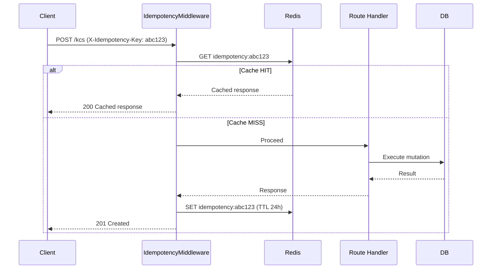
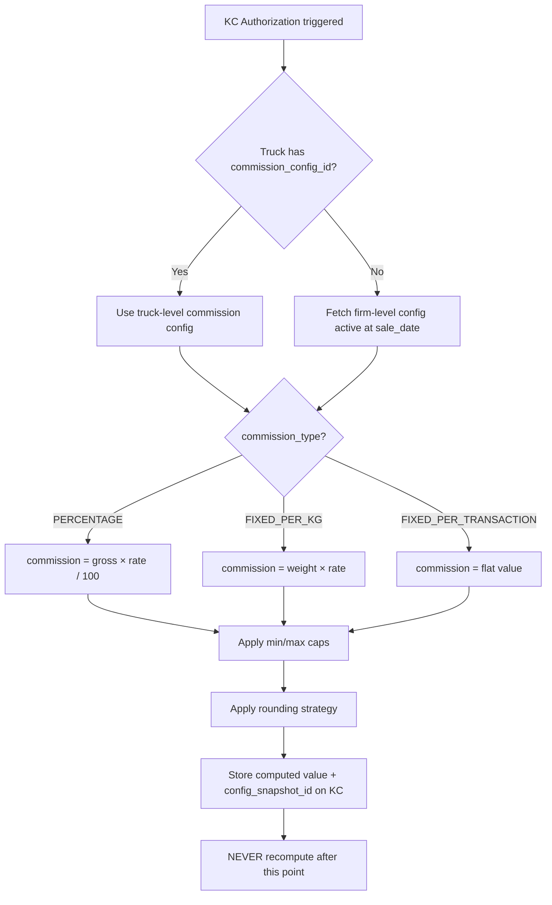

# Smart Mandi — Low-Level Design (LLD)
## Version 2.0 · Phase 11 PDF Generation & SA Config Expansion (All Phases Complete)

---

## 1. Module Architecture (NestJS)

```mermaid
graph TB
    subgraph "NestJS Application"
        AM[AppModule]
        AM --> DBM[DatabaseModule<br/>TypeORM + pg]
        AM --> CM[ConfigModule<br/>@nestjs/config]
        AM --> RM[RedisModule<br/>ioredis]
        AM --> SQSM[SQSModule<br/>aws-sdk]

        AM --> AuthM[AuthModule<br/>JWT Strategy]
        AM --> FirmM[FirmsModule]
        AM --> UserM[UsersModule]
        AM --> LedgerM[LedgerModule]
        AM --> EventM[EventStoreModule]
        AM --> AuditM[AuditModule]
        AM --> ConfigMod[ConfiguratorModule]
        AM --> CustomerM[CustomersModule]
        AM --> TruckM[TrucksModule]
        AM --> KCM[KacchaChitthaModule]
        AM --> DashM[DashboardModule]
        AM --> ReportM[ReportsModule]
        AM --> SalaryM[SalaryModule<br/>(tagged: freight)]
        AM --> RbacM[RbacModule<br/>RBAC + SuperAdmin]
        AM --> NotifM[NotificationModule<br/>FCM Push]
        AM --> PdfM[PDF Services<br/>KcPdf · BuyerSummaryPdf · DaybookPdf]
    end
```

---

## 2. Auth Module



### 2.1 RLS Context Setting (Critical)

```typescript
// FirmContextInterceptor sets firm_id in PostgreSQL session before every query
// SQL executed before handler: SET LOCAL app.current_firm_id = '<firm_id>'
```

### 2.2 JWT Payload

```typescript
interface JwtPayload {
  sub: string;          // user_id
  firm_id: string;      // tenant ID — injected into DB session
  role: UserRole;       // FIRM_HEAD | AUTHORIZER | OPERATOR | VIEWER
  device_id?: string;   // for offline conflict resolution
}
```

---

## 3. Ledger Engine (Core)



### 3.1 Group Integrity Rule

```
For every entry_group_id:
  SUM(amount WHERE entry_type=CREDIT) == SUM(amount WHERE entry_type=DEBIT)
Enforced at: application layer (pre-write) + nightly reconciliation job
```

### 3.2 Balance Computation (Stored, Never Recomputed)

```
balance_after = previous_balance + amount (if CREDIT)
balance_after = previous_balance - amount (if DEBIT)
Uses SELECT ... FOR UPDATE on running balance row
```

---

## 4. Event Store Module



### 4.1 Retry Strategy

```
retry_count < max_retries (default 5):
  - Exponential backoff: process_after = NOW() + 2^retry_count minutes
  - Update status = FAILED, increment retry_count

retry_count >= max_retries:
  - Move to DEAD_LETTER
  - Alert engineering team (CloudWatch alarm)
```

---

## 5. Audit Log Module



---

## 6. Database Schema — Entity Relationships



---

## 7. API — Request/Response Contracts (Phase 1)

### 7.1 Auth

```typescript
// POST /api/v1/auth/login
Request:  { phone: string; otp: string; firm_id: string }
Response: { access_token: string; refresh_token: string; expires_in: number; user: UserDto }

// POST /api/v1/auth/refresh
Request:  { refresh_token: string }
Response: { access_token: string; expires_in: number }
```

### 7.2 Ledger (Read-Only in Phase 1)

```typescript
// GET /api/v1/:firm_id/ledger/firm
Query: { from?: string; to?: string; page?: number; limit?: number }
Response: {
  data: LedgerEntryDto[];
  meta: { total: number; page: number; balance: string }
}
```

### 7.3 RBAC (Phase 7)

```typescript
// GET /api/v1/:firm_id/rbac/my-modules
Response: { module_ids: string[] }

// GET /api/v1/:firm_id/rbac/permissions/:role
Response: { permissions: { module_id: string; can_create: boolean; can_read: boolean; can_update: boolean; can_delete: boolean }[] }

// PUT /api/v1/:firm_id/rbac/permissions/:role
Request:  { permissions: { module_id: string; can_create: boolean; can_read: boolean; can_update: boolean; can_delete: boolean }[] }
Response: { updated: number }
```

---

## 8. RBAC Module



---

## 9. Customer History API



```typescript
// GET /api/v1/:firm_id/customers/:id/history
Response: {
  customer_id: string;
  outstanding_udhar: string;         // Decimal string (rupees)
  total_purchases: number;           // count of AUTHORIZED KCs
  total_value: string;               // sum of total_net_payable
  kcs: Array<{
    id: string;
    kc_number: string;
    sale_date: string;
    status: KCStatus;
    total_net_payable: string;
    total_gross_amount: string;
    commission: string;
    apmc_fee: string;
    line_items: KcLineItemDto[];
    payments: KcPaymentDto[];
  }>;
}
```

---

## 10. Super Admin API Contracts

```typescript
// POST /super-admin/login?admin_token=<token>  (No JWT required — @Public())
Request:  { phone: string; otp: string }
Response: { access_token: string; admin: { id: string; name: string; phone: string } }

// GET /super-admin/firms?admin_token=<token>
Response: FirmDto[]  // { id, name, apmc_name, contact_phone, is_active, created_at }

// POST /super-admin/firms?admin_token=<token>
Request:  { name: string; apmc_name: string; contact_phone: string; address?: string;
            firm_head?: { phone: string; name: string } }
Response: FirmDto  // firm created + all 11 modules auto-granted + optional FIRM_HEAD user created

// PUT /super-admin/firms/:id?admin_token=<token>
Request:  { name?: string; apmc_name?: string; contact_phone?: string; address?: string }
Response: FirmDto

// DELETE /super-admin/firms/:id?admin_token=<token>
Response: { deactivated: true }

// GET /super-admin/firms/:firmId/modules?admin_token=<token>
Response: { module_ids: string[] }

// PUT /super-admin/firms/:firmId/modules?admin_token=<token>
Request:  { module_ids: string[] }
Response: { updated: number }
```

---

*Last updated: Phase 8 — All phases complete*

---

## 11. Idempotency Flow



---

## 12. Commission Calculation Flow



---

*Last updated: Phase 8 — All phases complete*
